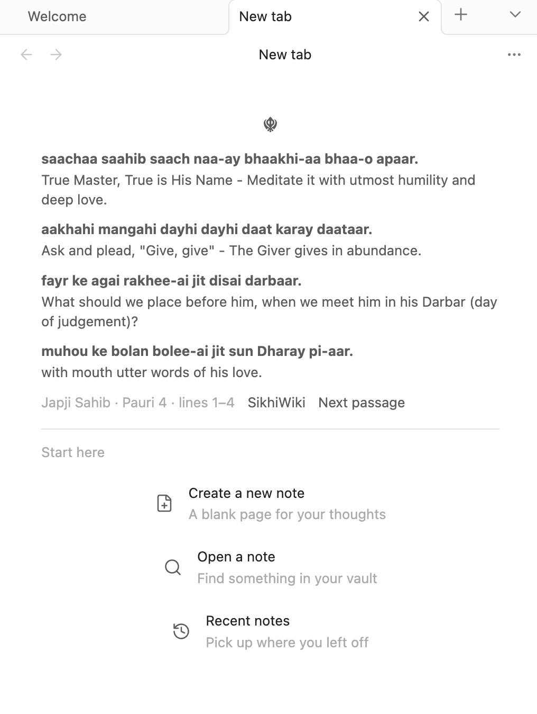
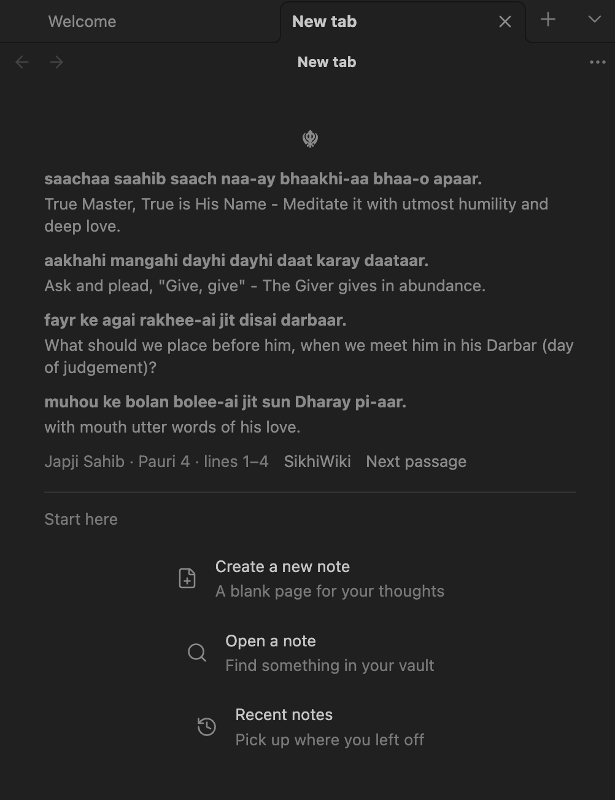
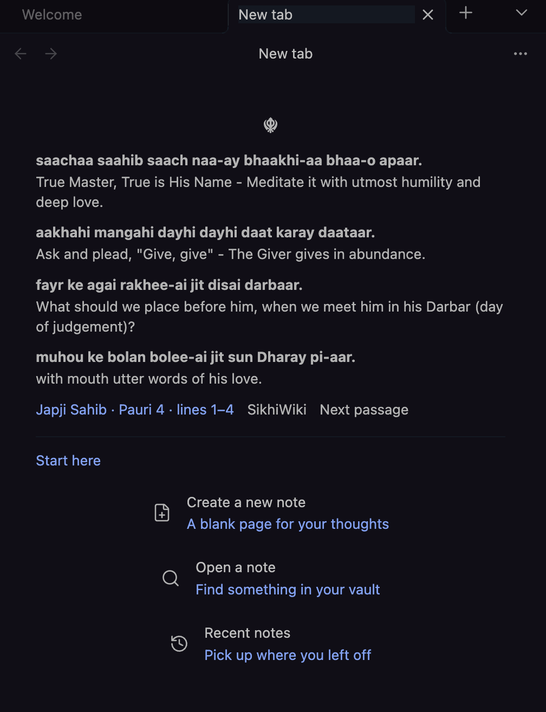

# ☬ New Tab Japji

Start each Obsidian tab with a short passage from Japji Sahib, in Roman transliteration with its English translation.

- Read in order: up to four rows at a time, or two for pauris with paired sentences. Passages never cross a pauri boundary.
- Continue with each new tab or **Next passage**, with your place saved across restarts.
- A centered ☬ and compact text using your theme’s UI fonts and colors, so it fits naturally into Obsidian.
- Shortcuts to create a note, find a note, or return to recent notes.
- The complete text ships with the plugin and works offline from the first launch.

Dark mode with the **Blue Topaz** theme:

Dark mode with the **Obsidianite** theme:

Enable **New Tab Japji**, then open a new tab to begin.

[Local installation, development, and release guide](docs/DEVELOPMENT.md)

## Attribution

Text and translation: [SikhiWiki contributors — Learn all of Japji Sahib](https://www.sikhiwiki.org/index.php/Learn_all_of_Japji_Sahib), under [GFDL 1.2 or later](data/GFDL-1.2.txt). See [source and adaptation details](data/NOTICE.md). Plugin code: [MIT](LICENSE).
